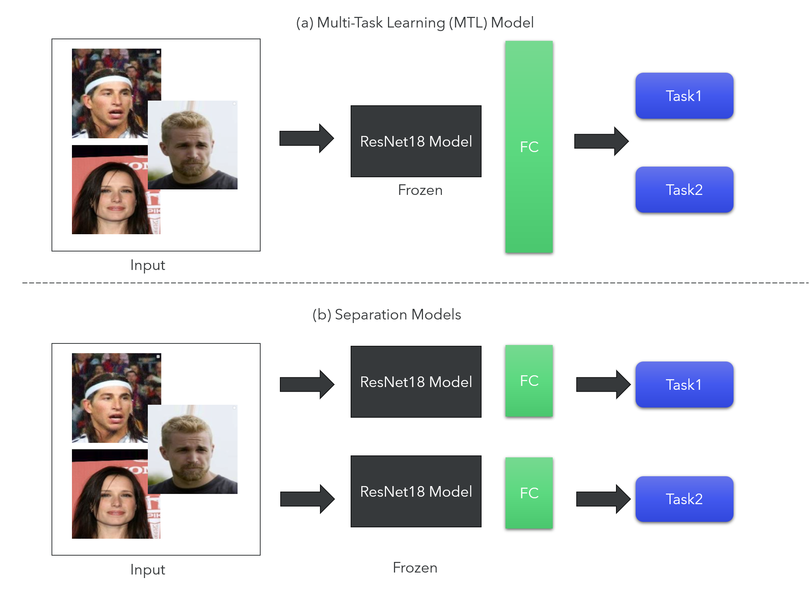

# Multi-Task-Learning-Model

## Motivation

In many real-world scenarios, it is necessary to predict multiple tasks simultaneously. Translating this intuition to the deep learning field, the goal is to predict all these tasks using a single model rather than training a separate model for each one. Moreover, knowledge gained from one task can be transferred to related tasks, which helps improve overall prediction performance.

In landmark location detection, humans can easily infer the position of the mouth or eyes by using other facial features as context. In this project, we explore this intuition using the CelebFaces Attributes (CelebA) Dataset, which includes 40 binary attribute annotations and 5 landmark locations per image.

Multi-Task Learning (MTL) Model is a sub-field of machince learning for solve multiple different tasks at the same time. The features learned by the shared backbone serve as a universal language for all tasks. Knowledge gained from training one task can naturally benefit other tasks when the learned patterns are relevant to both [1,2].

## Project Aim

This study aim to answer the following hypotheses: Does MTL achieve better performance than training a separate model for each task? In other ward, Do multiple tasks provide positive transfer and improve each other’s performance?

## Resulte

In this evaluation, the Multi-Task Learning model performs comparably to or slightly better than the single-task models across both Attribute Recognition (e.g., Macro Accuracy of  0.7966 for MTL vs. 0.7945 for Single model) and Landmark Localization (e.g., MAE of 0.0081 for MTL vs. 0.0082 for Single Model). This indicates that the MTL setup is effectively leveraging shared knowledge, avoiding negative transfer, and achieving similar (or slightly improved) results with the potential benefits of efficiency and a unified architecture.

## Reference

[1] Yu, J., Dai, Y., Liu, X., Huang, J., Shen, Y., Zhang, K., Zhou, R., Adhikarla, E., Ye, W., Liu, Y. and Kong, Z., 2024. Unleashing the power of multi-task learning: A comprehensive survey spanning traditional, deep, and pretrained foundation model eras. arXiv preprint arXiv:2404.18961.

[2] https://www.geeksforgeeks.org/deep-learning/introduction-to-multi-task-learningmtl-for-deep-learning/

[3] He, K., Zhang, X., Ren, S. and Sun, J., 2016. Deep residual learning for image recognition. In Proceedings of the IEEE conference on computer vision and pattern recognition (pp. 770-778).
